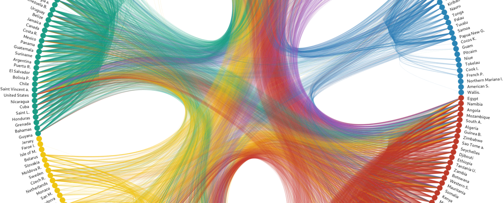

{{ site.subtitle }}

{{ site.lecture_type }}, {{ site.semester }}, {{ site.university }}

In this hands-on seminar, bachelor students of social and cultural sciences learn the basics of programming, among other essential technical skills. Building on a modern technology stack, it aims to prepare students to conduct data-driven text analysis and to make everyday life easier by fostering technological fundamentals. While learning about the importance of computation in solving problems, we also discuss the current developments in information technology. In short, the course promotes digital literacy on a practical and theoretical level.

This seminar focuses on the computational processing of digital and digitized texts using Python and the command-line. For any empirical research, the systematic preparation and aggregation of data and the swift retrieval of information are critical. These tasks require the handling of various data forms, including data that is not yet structured in a tabular format. The seminar covers the complete workflow, from gathering textual data to analyzing an entire text collection to producing interactive visualizations. Sounds cool? It certainly is.

Along the way, we deal with questions like these:

* How can texts be quantitatively exploited to complement the qualitative content analysis?
* What are regular expressions, and why are they so powerful in the context of computational text analysis?
* How to download data automatically from websites and process *en masse*?
* How can historical texts be extracted from PDFs using Optical Character Recognition (OCR)?

[<i class="fas fa-external-link-alt"></i> Go to UniLu website](https://portal.unilu.ch/details?code=FS211368)

