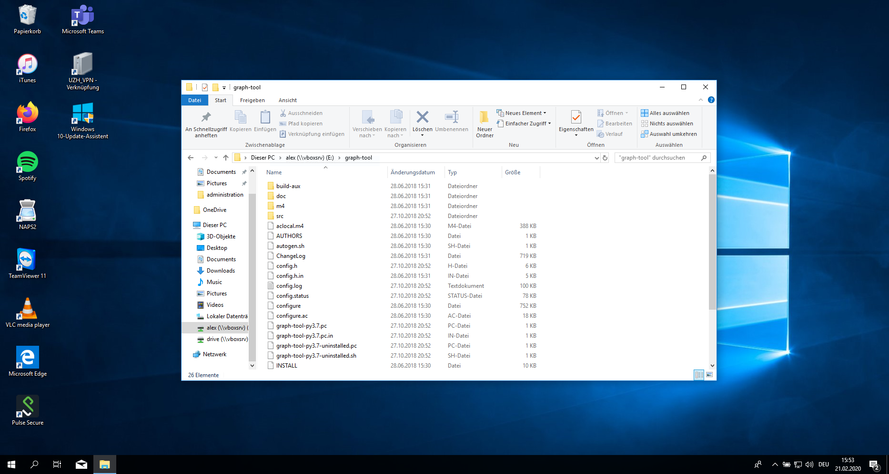

## Outline

- research workflow :bookmark_tabs:
- interacting with computers :magic_wand:
- installation of programs :hammer: 

::: notes

- Exkurs: wieso braucht es das ganze Tooling?
  - Wissenschaft als Praxis
- Grundverständis für Mensch-Maschine-Interaktion
- Installation
  - abschliessen/Fehler beheben
  - Zeitplan für Installation schwierig abzuschätzen
  - Feierabend wenn System läuft

:::

## Recap last Lecture

- textual data is challenging
- machine-readable data 

::: notes

- Bedeutung ist kontextabhängig
- Unvergleichbarkeit diskreter Symbole
- Ziel: Abstraktion + Kontextualität kombinieren
  - Quali + Quanti
  - Generalisierung + Rekontextualisierung
- Fragen
  - wichtigste Dateiformate?
    - txt, csv, tsv (xml)
  - Sinn von Texteditor?
    - keine Formatierung

:::

# The Zen of Organizing {data-background=../images/puzzle_unsplash.jpg .white-text}

## Research means Organizing 

### How a computational approach helps

- scripts as documentation :memo:
- efficient automation :recycle:
  - "don't repeat yourself"
- less error-prone :woman_facepalming: :man_facepalming:
- reproducible :100:

::: notes

- Wissenschaft auch praktische Seite, nicht nur theoretische
  - chaotisch statt strukturiert (aufgeräumte Papers kommen erst ganz am Ende)
  - Organisation von Komplexität als Problem
- Reproduzierbarkeit ist Arbeitsgrundlage und höchster Wert (mehr noch als Wahrheit)
  - Wiederverwendung von Code/Datensatz + Literatur/Theorien
- Wieso computational approach?
  - Reproduzierbarkeit und Kritisierbarkeit garantiert
  - Automatisierung von repetitiven Aufgaben -> spart Zeit
- Code strukturiert/dokumentiert Arbeitsablauf/Entscheidungen
  - gegen Vergessenheit
  - schützt nicht vor Fehler, aber sichert inkrementellen Fortschritt
- wichtig für grössere Projekte + Abschlussarbeiten
- kurzfristig langsamer, langfristig effizienter
  - keine mühsame Fehlersuche, Wiederholung

[image-src](https://unsplash.com/photos/3y1zF4hIPCg)

:::

## Organizing Literature

. . .

:::::::::::::: {.columns}

:::{.column width="50%"}

- manage literature in one place
- generating bibliographies
- collect with a click in your browser

:::

:::{.column width="50%"}

 is a free, open-source software for managing scientific literature](../images/zotero.png)

:::

::::::::::::::

::: notes

- Organisation betrifft auch Literatur
- Fragen, wer Literaturverwaltungssystem nutzt
  - was? wieso nützlich?
- Zotero
  - open-source, viele Features, konstante Weiterentwicklung
- Nutzen
  - verschiedene Zitationsstile
  - einmal indexiert, immer gleich
  - Recherche: Metadaten automatisch setzen
  - Bibliographie automatisch zusammenstellen

:::

# Computers

## Two Trends in Computing

:::::::::::::: {.columns}

:::{.column width="70%"}

- everyday, mobile, cloud-centered, touch/click-based approach
  - single-purpose application
  - smartphones + tablets
- engineering, open-source, machine-oriented approach
  - powerful due to modularity
  - workflow for data science

[see also @Healy2019]

:::

:::{.column width="20%"}

:::

::::::::::::::

::: notes

- Computer haben sich massiv verändert -> am meisten an Oberfläche
- Spannungsfeld zweier Trends
  - Einfachheit --> Eingeschränktheit; nur machen, was vorgesehen ist
  -  Flexibilität --> technisches Vorwissen
- Apple: GUI/Bedienung Angleichung an physische Welt
- Engineering: schwieriger Einstieg/Lernen, dafür sehr viel effektiver/vielseitiger
  - ist alternativlos für Standardisierung unstandardisierter Daten
  - keine Zauberei, aber sehr nützlich
- von Wissen/Tools der Engineers profitieren
  - nicht selber Tools bauen
  - geniale Arbeitsabläufe + Modularität

:::

## Operating Systems (OS)

### Between hardware and programs

- Microsoft Windows
- macOS
- Linux-based systems :nerd_face:

::: notes

-  OS
  - Windows = Dominator, Alltag
  - Linux = stable, secure, free, innovative. Became more user-friendly, sometimes still issue
  - Mac = restricted to Mac HW, Unix-Derivat, vereint beide Welten
- Betriebssysteme wie Fahrräder oder Autos
-  Systeme gleichen sich immer mehr an
   - Installation von Linux in Windows

:::

## User Interfaces

:::::::::::::: {.columns}
::: {.column}

### graphical user interface (GUI)

{ height=14cm }

:::

:::{.column}

### command line interface (CLI)

{height=14cm}

:::

::::::::::::::

::: notes

- historisch nur CLI zur Computersteuerung
- GUI von Apple entwickelt 1984, in 90er Standard
- CLI ist mehr als Sentimentalität
  - mächtiger dank Automatisierbarkeit
  - schneller
  - auf Server einzig mögliche Interaktion

:::

## **"An awesome Programmer saves the World"** {data-background=https://media.giphy.com/media/AOSwwqVjNZlDO/giphy.gif}

::: notes

- CLI auch in Popkultur, allerdings falsch dargestellt

:::

## Human-Machine Interaction

### How to tell the computer effienctly

- text commands instead of clicks
- similar to human languages
  - syntax (form)
  - semantics (meaning)
- computers are literalists

::: notes

- Automatisierung über GUI nicht möglich
  - statt "hier" klicken, einfach Skript
- viele verschiedene Programmiersprachen
- Syntax sehr restriktiv
  - Computer sind ziemlich doof, aber sehr gehorsam.
  - Machen genau, was man ihnen sagt, nichts mehr, nichts weniger. Nie.

:::

## Programming

- command languages
  - Bourne-Again shell (Bash), since 1989
- programming languages
  - Python, R, Java, C++ etc.
- instructions &rarr; program &equiv; algorithm
  - cooking

::: notes

- CLI primär für Dateimanipulation/Verarbeitung
- Python
  - einfach: reduziert auf das elementare
  - Python is a general-purpose language whereas R is a statistical programming language. 
- Software heisst neuerdings Algorithmus
  - falsch: "Algo als Böses/Mystisches"
  - korrekt: schrittweise Umwandlung von Input zu Output
  - software = program + data (complement HW)

:::

## Package Manager

- automation of software installation

  - system: apt, Homebrew
  - Python: pip, conda

- software dependencies

- similar to app stores

  

::: notes

- SW baut auf weiterer SW auf
  - keine vollständigen Programme
  - bei Installation hunderte von Kompatibilitäts-Checks
- zentrale Verwaltung installierter SW
  - update aller Programme mit einem Befehl
- 2 Manager: systemweit, Python
- app stores keine Innovation
- gehört auch zur Arbeitsorganisation

:::

## Open-Source is a Mindset

### Standing on the shoulders of giants

- free + open software
- cross-platform portability
- collaboration 
  - share + reuse
- helpful community

::: notes

- Zusammen erreicht man mehr -> Abhängigkeiten
- Abhängigkeiten funktionieren am besten, wenn offen
  - Rückmeldungen -> gemeinsame Verbesserung
  - schnelle Weiterentwicklung
- CS offenste Disziplin
  - Private + Firmen
  - oft unentgeltlich

:::

## Resources everyone is using

- [Stack Overflow](https://stackoverflow.com/questions)
  - where you get answers to technical questions
- [GitHub](https://github.com/)
  - where you find open software

::: notes

- Kollaboration nicht nur für SW, auch für Fragenbeantwortung
- allermeiste Fragen/Probleme nicht neu, schon beantwortet
  - bash commands auf stackoverflow
  - installationsprobleme
- Github
  - source code + anleitung für Millionen von Programmen (klein und gross)
  - repository

:::

## Learning by doing, doing by Googleing.  :woman_cartwheeling::man_cartwheeling: {data-background=#4d7e65}

::: notes

- Technical problems are normal + solutions around the corner
  - Fehlermeldung lesen + googlen
- Without the internet, you are a nobody

* Installation is sometimes harder and much more poorly documented than mere usage

:::

# Set up your System

## Backup :japanese_ogre:{data-background=#b5533c}

You don't need it until you desperately need it!

## Setting up your Development Environment{data-background=#3c70b5}

### Installation

- Python 3.8
  - packages for NLP + visualization
- Tesseract
- various Bash tools 
- VS Code Editor

:point_right: Follow the [installation guide](https://aflueckiger.github.io/KED2022/materials/installation_guide.pdf) for your OS.

::: notes

- verschiedene Installationsmöglichkeiten
  - Idee: plattformübergreifend, relativ einfach, uneingeschränkt
- Windows Leute installieren Ubuntu für Bash
- Installations Guide folgen
  - Verstehen aktuell egal
  - Fragen/Verbesserungsvorschläge willkommen
  - Ablauf verfolgen & auf Fehler achten

:::

# Relax.  It takes a while.{data-background=https://media.giphy.com/media/ZsbqQrUrzRtN6/giphy.gif .white-text}

## VS Code Editor

:::::::::::::: {.columns}
::: {.column}

### The Microsoft Word for coding

-  powerful integrated development environment (IDE) 
- cross-platform
- interactive analysis

:::

::: {.column}

](../images/vs_code_hello_world.png)

:::

::::::::::::::

::: notes

- in-class demonstrieren
- Visual Studio: Code, Erklärung, Output an selbem Ort

:::

## First Steps in Python

Learn Python with interactive tutorials

- [Python Principles](https://pythonprinciples.com)
- [LearnPython](https://www.learnpython.org/en/Welcome)

::: notes

- Python individuell vertiefen

:::

## Readings 

### optional: pimp your workflow

Healy, Kieran. 2019. “The Plain Person’s Guide to Plain Text Social Science.” [online](https://kieranhealy.org/publications/plain-person-text/).

# Questions?{data-background="../images/paint-anna-kolosyuk-unsplash.jpg" .white-text}

## References

