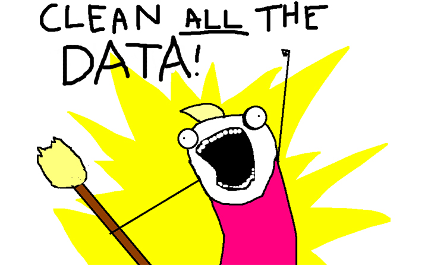

## Updated Schedule

| Date             | Topic                                                        |
| ---------------- | ------------------------------------------------------------ |
| 25 February 2022 | [Introduction + Where is the digital revolution?](https://aflueckiger.github.io/KED2022/lectures#week-1-introduction--where-is-the-digital-revolution) |
| 04 March 2022    | [Text as Data](https://aflueckiger.github.io/KED2022/lectures#week-2-text-as-data) |
| 11 March 2022    | [Setting up your Development Environment](https://aflueckiger.github.io/KED2022/lectures#week-3-setting-up-your-development-environment) |
| 18 March 2022    | [Introduction to the Command-line](https://aflueckiger.github.io/KED2022/lectures#week-4-introduction-to-the-command-line) |
| 25 March 2022    | [Basic NLP with Command-line](https://aflueckiger.github.io/KED2022/lectures#week-5-basic-nlp-with-command-line) |
| 01 April 2022    | [Learning Regular Expressions](https://aflueckiger.github.io/KED2022/lectures#week-6-learning-regular-expressions) |
| 08 April 2022    | *no lecture (Osterpause)*                                    |
| 15 April 2022    | **[Working with (your own) Data](https://aflueckiger.github.io/KED2022/lectures#week-7-regex--data-sources)** ~~Advanced RegEx + Data Sources~~ |
| 22 April 2022    | **[Ethics and the Evolution of NLP](https://aflueckiger.github.io/KED2022/lectures#week-8-ethics-and-the-evolution-of-nlp)** ~~Creating new Data Sets + Ethics~~ |
| 29 April 2022    | [Introduction to Python](https://aflueckiger.github.io/KED2022/lectures#week-9-introduction-to-python) |
| 06 May 2022      | [NLP with Python](https://aflueckiger.github.io/KED2022/lectures#week-10-nlp-with-python) |
| 13 May 2022      | *no lecture (Christi Himmelfahrt)*                           |
| 20 May 2022      | [NLP with Python + Working Session](https://aflueckiger.github.io/KED2022/lectures#week-11-nlp-with-python-ii--working-session) |
| 27 May 2022      | [Mini-Project Presentations + Discussion](https://aflueckiger.github.io/KED2022/lectures#week-12-mini-project-presentations--discussion) |
| 03 June 2022     | *no lecture (Fronleichnam)*                                  |

::: notes

- Umstellungen Sitzungen
- heute letzte Sitzung zu Kommandozeile
- heutige Sitzung über Daten
- Überlegen, was für eine Analyse in MiniProject

:::

## Recap last Lecture

- extract + replace textual parts with RegEx
  - literal: `abc`
  - meta: `\w \s [^abc] *`

::: notes

- Regex für Extraktion + Säubern
  - man muss nur ungefähr wissen wonach suchen
  - generalisierte Form = Muster
- Literale = Zeichen steht für tatsächliches Zeichen (buchstabentreu)
- Meta-Zeichen = Zeichen mit spezieller Bedeutung

:::

## Outline

- you are on spot! ✋ *#assignment2*
- learn about available data resources
- use your own textual data
  - any text :heavy_check_mark:
  - "any" format :heavy_check_mark:
  - from anywhere :heavy_check_mark:


::: notes

- dreiteilige Sitzung
  - Assignment 2, existierende Daten, eigene Daten
- interessannte Datasets  für die Sozialwissenschaften
  - es gibt allerdings nicht viele
  - zumeist eigene Daten präparieren
- eigene Textdaten nutzen unabhängig von
  - Formaten
  - historischem Kontext
  - Speicherort

:::


# Assignment #2

## Feedback Assignment #2

[example solution](https://github.com/aflueckiger/KED2022/blob/master/assignments/assignment_2/flueckiger_KED2022_2_solutions.sh)

- make patterns more general
  - date: `DD* Month DDDD`
- keep it simple
  - name of month ~ any word ~ `\w+`
- avoid false positives with positional information 
  - start of line: `^`
- names are hard to extract
  - variation + inconsistency

<br>

:nerd_face: check the count of matches with `wc` + the cleanup with `diff`


::: notes

- posititv: gut gelöst, Bearbeitungszeit unterschiedlich (1h - 5h)
- Ziel Patterns: allgemeine Struktur/Eigenschaften beschreiben 
- Tradeoff: generalisierung vs. spezifizität
  - Kunst ist: so generell wie möglich, so spezifisch wie nötig
- Checks
  - Zählen der matches, wenn Anzahl Metadaten bekannt
  - Differenz File vor und nach Bereinigung
- Haben alle Commands funktioniert?
- Fragen

:::


# Data Sources{data-background=../images/text_data_mining.jpg}


## What Data Sources are there?

- broadly social
  - newspapers + magazines
  - websites + social media
  - reports by NGOs/GOs
- scientific
  - journals
- economic
  - business plans/reports
  - contracts 
  - patents

:point_right: basically, any textual document...


:::  notes

- unheimliche Vielfalt an Dokumenten
- Textkollektion ist bereits vorhanden im Gegensatz zu Survey
  - given data statt created data
  - Datenbereinigungen sind nötig
- hier nur einen Bruchteil vorgestellt, soll als Inspiration dienen
  - Zeit reicht nicht, um auf alle Quellen einzugehen

[Image Credits](https://www.copyrightuser.org/understand/exceptions/text-data-mining/)

::: 


## Interesting Publishers

* [Nexis Uni](http://www.nexisuni.com/)
  * newspaper, business + legal reports (international)
  * licensed by the university
* [HathiTrust](https://www.hathitrust.org/datasets)
  * massive collection of books (international)
  * open, requires agreement
* [Project Gutenberg](https://www.gutenberg.org/)
  * huge collection of books (international)
  * open-access
* [Constellate](https://constellate.org/builder/) by JSTOR and Portico
  * scientific articles across disciplines
  * provides an easy dataset builder


:point_right: check out the licensed resources at [ZHB](https://www.zhbluzern.ch/recherche/e-medien)


::: notes

- Ressourcen gelistet auf ZHBLuzern 
  - Zugang tlw. über ezproxy
- Nexis vielleicht spannendste Quelle für Analyse soziale Probleme
- Wieso Literatur?
  - genderspezifische Sprache, Verweise Natur/Umwelt
- Constellate
  - brandneue Platform
  - einfache Zusammenstellung von JSTOR Artikeln 
  - sehr gute Metadaten
  - auch gut für schnelle Recherchen ohne Download

:::


## Dataset Search

* [Harvard Dataverse](https://dataverse.harvard.edu/)
  * open scientific data repository
* [Google Dataset Search](https://datasetsearch.research.google.com)
  * Google for datasets basically
* corpora by the [Department of Computational Linguistics @ UZH](https://www.cl.uzh.ch/en/texttechnologies/research.html)


<br>

:point_right: search for a topic followed by `corpus` or `text collection`


::: notes

* moderne Wissenschaft veröffentlicht nicht nur Paper, sondern auch Daten
* Suchmaschinen für Datensätze
  * allerlei Datensätze, primär aus Wissenschaft
* UZH hat Institut Computerlinguistik
* verschiedene Korpora
  * Credit Suisse PDF Bulletin Corpus

:::

## Search Techniques{data-background=var(--green)}

Make your web search more efficient by using dedicated [tags](https://support.google.com/websearch/answer/2466433?hl=en). Examples:

- `"computational social science"`

- ` nature OR environment`

::: notes

- Quotes für Wörter die zusammen gehören
- Boolean Search 
  - OR / AND

:::


## Some great historical Corpora

#### ready off the shelf, machine-readable

- [1 August speeches by Swiss Federal Councillors](https://www.republik.ch/2019/08/01/anleitung-fuer-die-perfekte-ansprache-zum-1-august)
  - provided via [course repo](https://github.com/aflueckiger/KED2022/blob/master/materials/data/dataset_speeches_federal_council_2019.csv)
- [Human Rights Texts](https://dataverse.harvard.edu/dataset.xhtml?persistentId=doi:10.7910/DVN/IAH8OY)
- [United Nations General Debate Corpus](https://dataverse.harvard.edu/dataset.xhtml?persistentId=doi:10.7910/DVN/0TJX8Y)


## Online Computational Text Analysis

* [Impresso](https://impresso-project.ch/app/)
  * many historical newspapers + magazines (CH, LU)
  * free, requires account
* [bookworm HathiTrust](https://bookworm.htrc.illinois.edu)
  * great filtering by metadata
  * credible scientific source
* [Google Ngram Viewer](https://books.google.com/ngrams#)
  * no filtering option
  * useful for quick analysis

::: notes

- Datenanalysen online durchführen
- Absicherung über andere Quellen
- Impresso: Complete re-digitization of the NZZ (together with the Zurich Central Library and Swiss National Library)

:::

## Copyright :no_entry_sign:

- may further limit access to high quality data
- check the rights before processing the data


)](../images/copyright.png){width=70%}


::: notes

- Zugang zu Daten nicht immer einfach
  - open data unterschiedlich unterstützt
- Datenbereitstellung oftmals Teil von Geschäftsmodell
  - dann restriktiv
- oftmals ist Verwendung nicht geregelt
  - nutzt Graubereich

:::


# Preparing your own Data

## A world for humans ...<br>... and a jungle of file formats.{data-background=../images/file_types.jpg .dark-text}

<!-- https://www.studio-24-7.com/file-formats-and-their-uses-explained/ -->

::: notes

- extrem viele File-Typen
- mühsam, aber es gibt einfache Tools für Umwandlung

:::


## Common Conversions

#### news, press releases, reports from organizations


:::::::::::::: {.columns}

:::{.column width="50%"}

:arrow_down:

digital native documents <br>`.pdf`, `.docx`, `.html`<br>

:arrow_down:

convert to `.txt`

:::

:::{.column width="50%"}

:arrow_down:

scans of (old) documents <br>`.pdf`, `.jpg`, `.png`<br>

:arrow_down:

Optical Character Recognition (OCR) 

:::

:::::::::::::: 


**machine-readable** :white_check_mark:


::: notes

- PDF ist Publikationsstandard
  - neue (digital) vs. alte (scans)
  - Kriterium: Suche möglich?
- anschliessend Schritte zur Umwandlung der wichtigsten Formate
- Keine Konzepte lernen, wie bei RegEx
  - nur welches Tool, für welche Umwandlung
  - mehr oder weniger copy-paste

:::


## Conversion of DOCX

#### use case: news articles from [Nexis](https://www.nexisuni.com/)

- `pandoc` to convert many file formats
- download as single articles in `.docx` on Nexis

```bash
# convert docx to txt
pandoc infile.docx -o outfile.txt

### Install first with
brew install pandoc 	# macOS
sudo apt install pandoc # Ubuntu
```


<!-- [](../images/nexis.png) -->

::: notes

- pandoc ist ein fast-alles Könner für Dokumentkonversion
  - kann auch html konvertieren: pandoc slides/KED2022_01.html -t plain
- zusätzliche Installation
- Nexis = News-Datenbank
  - freier Zugang ezproxy
  - kennen ezproxy alle?

:::

## Conversion of native PDF

#### use case: [Swiss party programmes](https://visuals.manifesto-project.wzb.eu/mpdb-shiny/cmp_dashboard_dataset/)

- `pdftotext` extracts text from non-scanned PDF

```bash
# convert native pdf to txt
pdftotext -nopgbrk -eol unix infile.pdf

### Install first with
brew install poppler 			# macOS
sudo apt install poppler-utils 	# Ubuntu
```


::: notes

- pdftotext: Name ist Programm
  - Outputfilename kann nicht spezifiziert werden
- dieselben Parteiprogramme, die wir schon analysiert haben
- Layout kann Extraktion erschweren
  - Spalten/Tabelle
- Häufigkeitsanalysen von Wörter sind robust, Struktur egal

:::

## Optical Character Recognition (OCR)

:::::::::::::: {.columns}

:::{.column width="50%"}

- OCR ~ convert images into text
  - extract text from scans/images
- `tesseract` performs OCR
  - language-specific models
  - supports handwriting + Fraktur texts
- image quality is crucial


:::

:::{.column width="50%"}

](../images/ocr.png)

:::

::::::::::::::


::: notes

- tatsächlicher Buchstabe, nicht nur Bild davon

- Zwischenschritt Verbesserung Kontrast, B/W

- technisch Deep-Learning, nicht weiter von Bedeutung

- auch von Handy-Bildern möglich, ohne teure Programme


:::


## Conversion of digitalized PDF

#### use-case: [historical party programmes](https://visuals.manifesto-project.wzb.eu/mpdb-shiny/cmp_dashboard_dataset/)

1. extract image from PDF + improve contrast
2. run optical character recognition (OCR) on the image

```bash
# convert scanned pdf to tiff, control quality with parameters
convert -density 300 -depth 8 -strip -background white -alpha off \
infile.pdf temp.tiff

# run OCR for German ("eng" for English, "fra" for French etc.)
tesseract -l deu temp.tiff file_out

### Install first with
brew install imagemagick			# macOS
sudo apt-get install imagemagick	# Ubuntu
```


::: notes

- Zwei Schritte: Bildumwandlung + OCR
- tesseract funktioniert für viele Bildformate
  - nicht direkt für PDF
- Beispiel: Kassenbon fotografieren & mit Regex parsen
  - Wirtschaftswissenschaften: indexierter Warenkorb

:::

## #LifeHack: Make a PDF searchable {data-background=var(--green)}

#### use case: scanned book chapters

```bash
# output searchable pdf instead of txt
convert -density 300 -depth 8 -strip -background white -alpha off -compress group4 \
file_in.pdf temp.tiff

tesseract -l deu temp.tiff file_out pdf
```


::: notes

- Output als PDF statt Text
- für Suchen/Zitate rauskopieren
- convert hier mit Kompression, da PDFs zu gross werden ansonsten

:::


## Scraping PDF from Websites

#### use case: [Swiss voting booklet](https://www.bk.admin.ch/bk/de/home/dokumentation/abstimmungsbuechlein.html)

- `wget` to download any files from the internet

```bash
# get a single file
wget EXACT_URL

# get all linked pdf from a single webpage
wget --recursive --accept pdf -nH --cut-dirs=5 \
--ignore-case --wait 1 --level 1 --directory-prefix=data \
https://www.bk.admin.ch/bk/de/home/dokumentation/abstimmungsbuechlein.html

# --accept FORMAT_OF_YOUR_INTEREST
# --directory-prefix YOUR_OUTPUT_DIRECTORY
```


::: notes

- bis hierher: Wie Daten in txt Format bringen
- jetzt Download automatisieren
  - Vorteil: schneller systematischer Download & Dokumentation von Quellen
- Haupt-URL angeben, wo PDF verlinkt sind
- Scraping von Blogs möglich über Python
  - nicht Teil von Seminar
- nicht auf alle Argumente eingehen 

:::

## Example Sources

* [Party Programmes across Europe](https://visuals.manifesto-project.wzb.eu/mpdb-shiny/cmp_dashboard_dataset/)
* [Swiss voting booklets](https://www.bk.admin.ch/bk/de/home/dokumentation/abstimmungsbuechlein.html)
* [1 August speeches by Swiss Federal Councillors](https://www.admin.ch/gov/de/start/dokumentation/reden/ansprachen-zum-nationalfeiertag.html)
* [Nestlé Annual Reports](https://www.nestle.com/csv/performance/downloads)
* ... any organization of your interest :thumbsup:


## Foundation of Batch Processing

#### perform the same operation on many files

```bash
# loop over all txt files
for file in *.txt; do

	# indent all commands in loop with a tab

	# rename each file
	# e.g. a.txt -> new_a.txt
	mv $file new_$file

done
```


::: notes

- Batch Processing = gleiche Operation durchführen für alle Files
- Erklären von Loop/Schleife und Variable
  - Wildcard zur Selektion > Liste von Files > Variable
- for-loop wichtiges Programmierkonzept
- Tabulator fürs Einrücken

:::

## Perform Batch OCR from PDF

```bash
for FILEPATH in *.pdf; do
	# convert pdf to image
    convert -density 300 $FILEPATH -depth 8 -strip \
    -background white -alpha off temp.tiff
    
    # define output name (remove .pdf from input)
    OUTFILE=${FILEPATH%.pdf} 
    
    # perform OCR on the tiff image
    tesseract -l deu temp.tiff $OUTFILE
    
    # remove the intermediate tiff image
    rm temp.tiff

done
```


::: notes 

- sehr ähnlich wie vorher, nur für jedes einzelne File jetzt

:::

## Preprocessing → RegEx{data-background=var(--red)}



::: notes

- Aufbereitung unterschiedlich aufwendig
- für schnelle Analyse nicht notwendig
- nun alles da für Mini-Project, ausser wenn Lösung in Python

:::


# Questions?{data-background="../images/paint-anna-kolosyuk-unsplash.jpg" .white-text}

## In-class: Exercises I{data-background=var(--blue)}

1. Make sure that your local copy of the Github repository KED2022 is up-to-date with `git pull`.  Check out the data samples and scripts in `materials/`.
2. Install the missing tools with the commands given on the respective slides: `pandoc, imagemagick, poppler`
3. **Digest the commands. Test them. Check the resources. Ask questions. Think about your mini-project.**
4. Use `wget` to download one or all *cogito* issues (PDF files) from the [UniLu website](https://www.unilu.ch/magazin/service/pdf-und-archiv/#section=c67079).
5. Convert the *cogito* PDF files into TXT files.
5. Use `wget` to download a book from Project Gutenberg and count some things (e.g., good/bad, joy/sad)
6. `wget` is a powerful tool. Have a look at its arguments and search for more examples in tutorials on the web.

## Resources

#### Make a more sophisticated script for PDF conversion

- Erick Peirson. 2015. Tutorial: Text Extraction and OCR with Tesseract and ImageMagick - Methods in Digital and Computational Humanities - DigInG Confluence. [online](https://diging.atlassian.net/wiki/spaces/DCH/pages/5275668/Tutorial+Text+Extraction+and+OCR+with+Tesseract+and+ImageMagick)

## References

