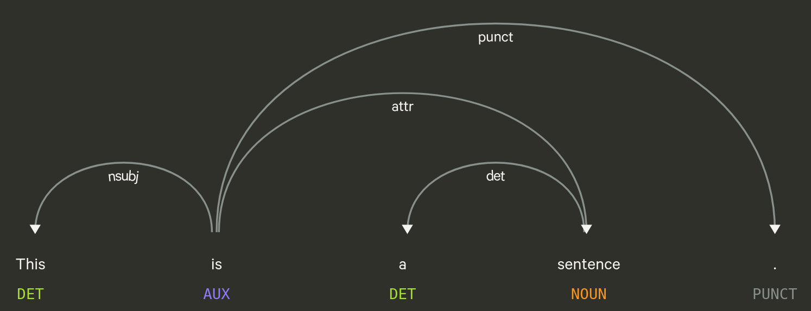

## Recap last Lecture

### introduce Python :snake:

- working with VS Code Editor

- learning programming concepts & syntax
  - data types, loops, indexing...

::: notes

:::

## Outline

- get the organizational stuff done
  - evaluation, mini-project, assignment #3
- let's do serious NLP! :sparkles:
- code interactively
  - interrupt, ask, and complement

::: notes

- Fragen sehr wichtig, da gewaltiger Sprung zu letzter Session
- Stellschrauben kennen lernen, Gefühl für die Sprache entwickeln
  - Details vorerst unwichtig
- dritt letzte Sitzung, neue Inhalte nur noch heute und nächstes Mal
- stream via Zoom

:::

<!-- https://towardsdatascience.com/building-a-text-normalizer-using-nltk-ft-pos-tagger-e713e611db8 -->

# Organizational

## Course Evaluation{data-background=../images/speech_bubbles.gif}

## Tell me... :mega:{data-background=var(--blue)}

### Please follow the link in the email

- received on 9 May 2022 (or similar)
- by the University of Lucerne, Faculty of Humanities and Social Sciences

 

### Thanks for any constructive feedback,   be it sweet or sour! :pray:

::: notes

- offene Kommentare nutzen, statt nur Kreuze
- 5min Zeit zum ausfüllen
- andere Code anschauen
- Tell me...
  - ... what you disliked
  - ... what you missed
  - ... what you learned

:::

## Assignment #3 :writing_hand:

- get/submit via OLAT
  - starting tomorrow
  - deadline 20 May 2022, 23:59
- use the [OLAT](https://lms.uzh.ch/auth/RepositoryEntry/17174430971/CourseNode/91271815676815) forum
  - subscribe to get notifications
- ask friends for support, not solutions

## Requirements of Mini-Project

### present project on 2 June 2022

- analyze any collection of documents

  - compare historically

  - compare between actors
- apply quantitative measures + interpretation
  - executable script
  - multiple documents
- form groups of 2-4 people

:exclamation: share your project idea [here](https://docs.google.com/spreadsheets/d/1VNyoCl7CsJXqko4DXw3ZwGo8QS055YEr42wjoUrkkZs/edit#gid=0) by 19 May 2022

::: notes

- mini project online stellen?
- noch nicht alle in Liste?
- "Forschungsfrage" überlegen
- script ist gemachte arbeit zur wiederverwendung
- relative frequency :thumbsup:
- absolute frequency :thumbsdown:

:::

## Optional Seminar Paper

- writing a seminar paper (6 ECTS)
- get in touch to discuss your idea

# A Primer on  Old School NLP{data-background=../images/words.jpg}

## What is a Word?

- words ~ segments between whitespace
- yet, there are ...
  - contractions: `U.S.`, `don't`
  - collocations: `New York`

## Token

:::::::::::::: {.columns}
::: {.column width="50%"}

- token ~ computational unit
  - representation of words
- lemma ~ base form of a word
  - `texts` &rarr; `text`
  - `goes` &rarr; `go`
- stop words ~ functional words
  - lacking deeper meaning
  - `the`, `a`, `on`, `and` ...

:::

::: {.column width="50%"}

)](../images/tokenization.jpeg)

:::

::::::::::::::

 

 `Let's tokenize this sentence! Isn't is easy?` :nerd_face:

::: notes

- Text wird in seine Teile gesplittet
- Lemma ~ Form in Duden

:::

## Common Processing Steps in NLP

:::::::::::::: {.columns}
::: {.column width="40%"}

1. Tokenizing
   - segmenting text into words, punctuations etc.
2. Tagging part-of-speech (POS)
   - assigning word types (e.g. verb, noun)
3. Parsing
   - describing syntactic relations
4. Named Entity Recognition (NER)
   - organizations, persons, locations, time etc.

:nerd_face: Catch up on NLP with @Jurafskyforthcominga

:::

::: {.column width="60%"}

:::

::::::::::::::

::: notes

- Abfolge von Prozessierungsschritten
- alles sprachabhängig
- Tagging: ca. 20-30 POS tags
- Parsing
  - Verb ist Head von Satz
  - Subjekt-Verb-Objekt

:::

## Modules/Packages

### No programming from scratch :tada:

- packages provide specific functionalities
- packages need to be installed first

::: notes

- Standing on the shoulders of giants
- alles auf GitHub

:::

## NLP Packages

- [spaCy](https://spacy.io/usage/spacy-101)
  - industrial-strength Natural Language Processing (NLP)
- [textaCy](https://textacy.readthedocs.io/en/latest/)
  - NLP, before and after spaCy
- [scattertext](https://github.com/JasonKessler/scattertext)
  - beautiful visualizations of how language differs across corpora

## Deep Dive into NLP for Social Science​​{data-background=var(--blue)}

- check [code](https://github.com/aflueckiger/KED2022/blob/main/materials/code/KED2022_10.ipynb) on GitHub
- run code on Binder  

## Resources

#### tutorials on spaCy

- [official spaCy 101](https://spacy.io/usage/spacy-101)
- [official online course spaCy](https://course.spacy.io/en/)
- [Hitchhiker's Guide to NLP in spaCy](https://www.kaggle.com/nirant/hitchhiker-s-guide-to-nlp-in-spacy)

# Questions?{data-background="../images/paint-anna-kolosyuk-unsplash.jpg" .white-text}

## References