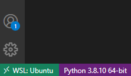
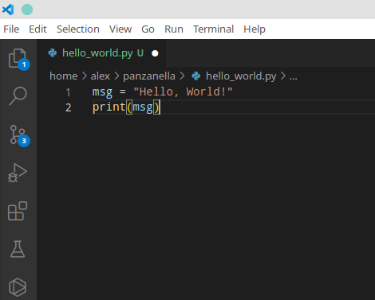

\pagebreak

# Introduction

**IMPORTANT NOTE: When you use a Mac and have Python 3/Anaconda installed already, let me know first before proceeding. Installing naively multiple Python versions may cause problems.**

This guide aims to ease setting up your development environment for Windows 10 and macOS. Depending on your operating system, you have to install additional components to program in Python and perform common data wrangling tasks in the command-line. The instructions cover the installation of the following components:

- Python 3.8
- VS Code Editor
- various Bash tools 
- Tesseract (Optical Character Recognition)

The proposed installation strikes a good balance between relative simplicity (e.g., no virtual environments in Python) and cross-platform usage of the tools. Be aware that the installation and setup of software are sometimes more difficult and poorer documented than its usage. Beyond potential problems during the installation, there are also different ways to set up the development environment. 

We write Python code using the VS Code. Although lightweight, it is a fully-fledged integrated development environment (IDE) supporting all major operating systems and many programming languages. Other than competing editors, it doesn't require much configuration and, out-of-the-box, it comes with indispensable features like auto-completion, code formatting, linting (error flagging) and debugging. In VS Code, you can even open and run [Jupyter Notebooks](https://jupyter.org/) to perform interactive data science showing the output next to the code that created it. 

Before you proceed with the installation, back up your files[^backup] and make sure that your computer fulfils the following two requirements:

- runs the most current version of your operating system (Windows, macOS). If not, update your system.
- has at least 15 GB of free disk space.

Keep in mind that you will not get *any* feedback in the command-line unless there is an issue. At first, the lack of feedback after a successful action may be confusing as it runs counter the general experience when working with graphical interfaces. However, the lack of feedback just means the command was executed as expected; thus, there is no need to bother you with further messages.

Let me know if you are struggling with any of the steps. 


[^backup]: "Better save than sorry." Backing up files is a must and may save you tears as a computer is a delicate piece of hardware that does not live forever. Moreover, users are also prone to mess up files or software at any point. In these cases, you just want to go back one step and restore your data.

# Installation Guide for macOS

## Install Command Line Tools

Despite being Unix-based, macOS is lacking some essential command-line tools out-of-the-box. In this section, we install the Command Line Tools first since these tools are also a requirement for the subsequent installation of the package manager Homebrew. 

1. Open a Terminal to get a command-line interface. When you cannot find the application in your system tray, press the `command` and `spacebar` keys to search and type `Terminal` to search for it.

4. Type the following command and press enter:
   ```bash
    xcode-select --install
   ```
   
3. In the dialogue that pops up, click `Install` and accept the terms and conditions.

4. As soon as the installer goes away, Command Line Tools should be installed successfully. To ensure that everything works as expected, run the following command:

    ```bash
    git --version
    ```
    When you see something like this `git version 2.x`, the installation was successfull.

Source: [OSXDaily](https://osxdaily.com/2014/02/12/install-command-line-tools-mac-os-x/)

## Install Package Manager Homebrew

Homebrew is a powerful package manager for macOS systems. With Homebrew, you can easily install programms using the Terminal.

1. To install Homebrew, type the following command into your Terminal window: 
   
   ```bash
   /bin/bash -c "$(curl -fsSL \ 
   https://raw.githubusercontent.com/Homebrew/install/master/install.sh)"
   ```
   When there is an issue executing this command (i.e., unprintable characters), copy the identical looking installation command from the [offical website](https://brew.sh/) into your Terminal.


2. You can make sure that Homebrew was successfully installed by typing: 

    ```bash
    brew doctor
    ```

3. To ensure that your installation of Homebrew is up to date, run: 
   ```bash
   brew update
   ```

4. Although it is not needed for now, you can upgrade outdated packages altogether with: 
   ```bash
   brew upgrade
   ```

5. Once you’ve installed Homebrew, make Homebrew's Python the primary environment by setting the `PATH` variable. In a Terminal, run the following command to add a new `PATH` variable to the  `~/.profile` file:

   ```bash
   echo 'export PATH="/usr/local/opt/python/libexec/bin:$PATH"' >> ~/.profile
   source ~/.profile
   ```
   


Source: [Homebrew](https://docs.brew.sh/FAQ)

## Install Python 3 with Homebrew

Homebrew makes it easy to install Python 3. 

1. Run the following command in a Terminal:

    ```bash
    brew install python
    ```

2. When Python 3 has been installed correctly on your system, you should see version 3.x after issuing the following command:

    ```bash
    python --version
    ```

Source: [The Hitchhiker’s Guide to Python](https://docs.python-guide.org/starting/install3/osx/)

## Install additional command-line tools

### Tesseract

1. Install the text recognition engine Tesseract, which allows extracting text from images, with: 

   ```bash
    brew install tesseract
   ```

2. Install the various language models for Tesseract with:

   ```bash
    brew install tesseract-lang
   ```


Source: [Tesseract](https://github.com/tesseract-ocr/tesseract/wiki)

### wget

1. Install the tool wget that allows you to retrieve content from web servers via the command-line with:

   ```
    brew install wget
   ```

<!--macOS Catalina introduced Zsh as the new default shell instead of Bash. To enable Zsh as new default on your system, type: chsh -s /bin/zsh -->

## Install VS Code

Unless you have another favourite coding editor, install and customize VS Code editor.

1. Download and install VS Code from the official website: [https://code.visualstudio.com/Download](https://code.visualstudio.com/Download). You may want to add a shortcut icon to the desktop.

2. Open VS Code. You can skip the initial configuration of VS Code by clicking *Next Section*.

3. To make programming in Python easier, you should install two more extensions: VS Code Python extension and Tabnine. Launch the *VS Code Quick Open* again by pressing `CMD` + `P` , paste the command, and press enter:

   ```
   ext install ms-python.python
   ```

   Similarly, install the extension Tabnine using the following command:

   ```
   ext install tabnine.tabnine-vscode
   ```

\pagebreak

# Installation Guide for Windows

## Install Ubuntu in a Windows Subsystem

To use the powerful Bash tools on your Windows computer, we install a Ubuntu Linux system within the Windows environment using WSL1.

1. Open `PowerShell` as administrator by right-clicking on the application icon in the start menu and run the following command in the shell:

   ```powershell
   wsl --set-default-version 1
   wsl --install -d Ubuntu
   ```
   
2. Reboot your computer to complete the installation of WSL and Ubuntu.

2. The installation should be completed automatically after the reboot. If not, you can launch Ubuntu from your Windows start menu. When you have any problems, let me know and I will gladly assist. It may require [additional configuration](https://askubuntu.com/questions/1264102/wsl-2-wont-run-ubuntu-error-0x80370102) of your BIOS.

2. Once the installation is complete, you will be prompted to create a new user account and set a password. 
   **IMPORTANT**: Remember these credentials as they are used to switch to the administrator mode on your Linux system. You may choose the same account name and password as on your hosting Windows system.
   
5. After the login, update your freshly installed Ubuntu system with the following commands:

   ```bash
   sudo apt update && sudo apt upgrade
   ```

6. Create a symbolic link in the Bash to easily access your files on Windows. For example, you may want to link the folder `Documents` on Windows to the symbolic folder `documents` on Ubuntu. To do this, replace the `<YOUR_USERNAME>` with the actual one and run the following commands:

   ```bash
   cd ~
   ln -s /mnt/c/Users/<YOUR_WINDOWS_USERNAME>/Documents documents
   ```

   Your `Documents` on Windows can be accessed like this:

   ```bash
   ls documents
   ```

8. Annoyingly, the copy/paste behaviour is different in command lines on Windows. Any selected text is copied automatically, and to paste it, you have to right-click on your mouse. You may want to reassign the shortcuts to `Ctrl+Shift+C` and `Ctrl+Shift+V` in the menu (`right-click` on the windows title bar &rarr; `Properties` &rarr; `Options` ). Using `Ctrl+C` is not possible as it is used to cancel a running program.


Source: [Microsoft](https://docs.microsoft.com/en-us/windows/wsl/install)

<!--- Credentials on the Ubuntu system in the virtual machine: user: ked password: start --->


## Install additional command-line tools

1. Open Ubuntu from your start menu in Windows.

2. Install essential tools via the command-line:

   ```bash
   sudo apt-get install build-essential
   ```

3. Install the Python package manager PIP:

   ```bash
   sudo apt install python3-pip
   ```


### Tesseract

1. Install the text recognition engine Tesseract, which allows extracting text from images, with:

   ```bash
   sudo add-apt-repository -y ppa:alex-p/tesseract-ocr5
   sudo apt install -y tesseract-ocr
   ```

2. Install the German language model for Tesseract with:

   ```bash
   sudo apt install tesseract-ocr-deu
   ```

Source: [Tesseract](https://github.com/tesseract-ocr/tesseract/wiki)

## Install the editor VS Code

Unless you have another favourite coding editor, install and customize VS Code editor.

1. Download and install VS Code from the official website: [https://code.visualstudio.com/Download](https://code.visualstudio.com/Download). You may want to add a shortcut icon to the desktop.

2. Open VS Code. You can skip all the configuration of VS Code by clicking *Next Section*.

3. We want to execute all the Python code within the Ubuntu subsystem. For this, we need to install a particular extension. Launch the *VS Code Quick Open* by pressing `CTRL`+`P`, paste the following command, and press enter:

   ```bash
   ext install ms-vscode-remote.vscode-remote-extensionpack
   ```

4. In the left lower corner, you should now see a green label with `WSL: Ubuntu` (see figure 1). If not, press `F1`, select *Remote-WSL: New Window* to connect the subsystem.

5. To make programming in Python easier, you should install two more extensions: VS Code Python extension and Tabnine. Launch again the *VS Code Quick Open* by pressing `CTRL`+`P`, paste the command, and press enter:

   ```
   ext install ms-python.python
   ```

   Similarly, install the extension Tabnine using the following command:

   ```
   ext install tabnine.tabnine-vscode
   ```

Source: [Microsoft](https://code.visualstudio.com/docs/remote/wsl)

{ width=4cm }


# Installation Guide for Linux

You presumably have installed some of the required tools already or you have the necessary knowledge to do so. Otherwise, ask me anytime or just google for a manual. Anyways, you are lucky as it is simpler than on the other platforms. Linux rules them all when it comes to development.

\pagebreak

# Getting started with Python (all Systems)

## Install Python packages

We need to install some additional packages that are not included in the Python standard library.

A common and easy way to install everything needed in a project is by using a provided `requirements.txt` file that lists all the used Python packages. You find such a file in the [repository of this seminar](https://github.com/aflueckiger/KED2022/), available on GitHub. We will learn more about GitHub and the installed packages later in the course. For now, you can think of a GitHub repository as a publicly available project folder that is versioned.

1. Open a command-line (Terminal on Mac, Ubuntu on Windows) and download the GitHub repository of this course. 

   ```bash
   # Windows user only:
   # Change into the `Documents` folder 
   # to make is easily accessible from Windows
   cd /mnt/c/Users/<YOUR_WINDOWS_USERNAME>/Documents
   
   # everyone
   git clone https://github.com/aflueckiger/KED2022.git
   cd KED2022
   ```

2. Now, you can install the necessary packages listed in the `requirements.txt` with a single command: 

    ```bash
    python3 -m pip install -r requirements.txt
    ```

## First Steps in Python

As a kind of initiation ritual, say hello to the programming world in Python. 

1. Open the VS Code editor and create a new file called `hello_world.py`.
2. Write the following code in that file:

    ```python
    msg = "Hello World!"
    print(msg)
    ```

3. Execute the code by right-clicking in the window and choosing `Run Python File in Terminal`.

Congrats, you wrote your first little program in Python. It may not be as impressive as you would have imagined, but you can go along and will learn by practising. The list of tutorials below provides a great starting point to learn the basics of Python by solving little exercises interactively:

- [Python Principles](https://pythonprinciples.com)
- [LearnPython](https://www.learnpython.org/en/Welcome)

{ width=6cm }
